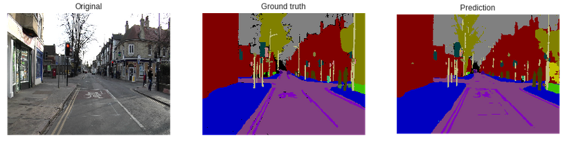
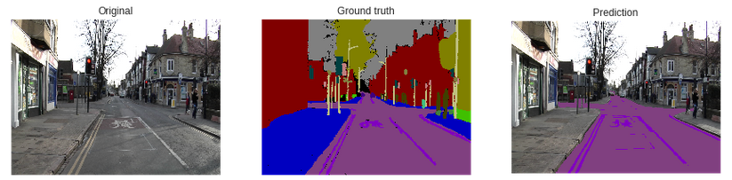

# Fully Convolutional Network for semantic segmentation

A FCN based on the [original paper](https://arxiv.org/abs/1411.4038) using PyTorch and trained on the [CamVid](http://mi.eng.cam.ac.uk/research/projects/VideoRec/CamVid/) dataset.

## Result

- Pixel accuracy of ``` 91.69% ``` 
- Mean IoU of ``` 0.3755``` 


###  Inference 
#### Prediction completely labeled.



#### Prediction partially labeled.



#### Inference on video 

